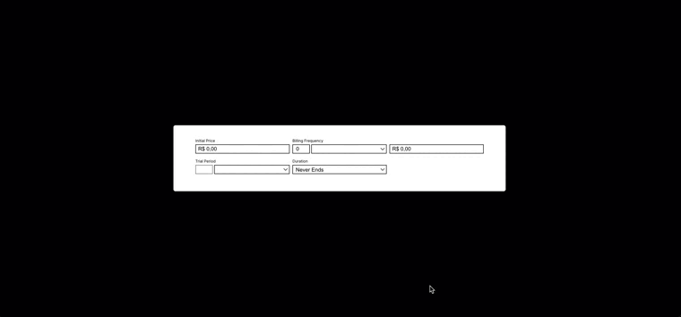

# Billing Form Test

this is a test project that creates billing labels that will be generated taking into account some variables.

it was built using Vite as build tool and you can check some docs references in the [references section](#references)

## Demonstration



## How to run

```bash
  git clone https://github.com/patriciob00/billing-form-test.git
  cd billing-form-test
  npm install
  npm run dev
```

## How to test

```bash
  npm run test
```
    
## References

 - [Vite docs](https://vitejs.dev/guide/)


